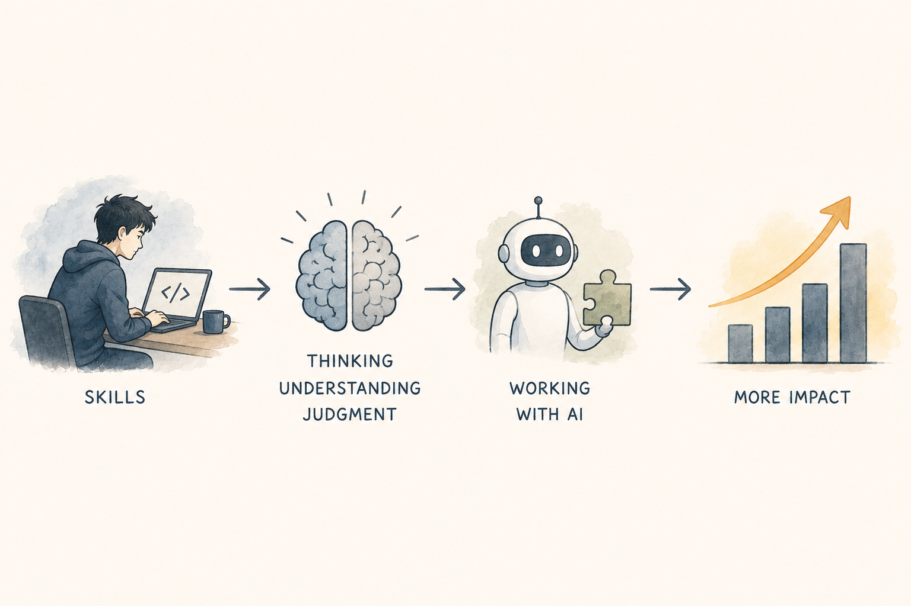

The famous [Five Monkeys experiment](https://en.wikipedia.org/wiki/Five_monkeys_experiment), a psychological fable on social conformity, came to my mind today. I was thinking that I may need to start coding manually again; otherwise, my brain will deteriorate in the age of agentic engineering. Not all the time, but at least sometimes. So maybe I should code some algorithms for fun. I like to write recursive functions. It is very hard, but once it clicks, it works like a charm. It is also impossible to debug, but with the right mindset, you can tame it like a cobra to music.

So, in the age of agentic engineering, do I need to sharpen my brain by practicing recursion and other coding skills? Does anyone need to? Surely AI can do it, so how close are we to humanity losing knowledge by relying on AI too much? Universities will continue teaching fundamentals for sure, but how much knowledge will get lost in the meantime? Knowledge that does not reach universities, that AI can reproduce, but that people gradually forget.

The monkey experiment is an analogy for a future state where an engineer talks to AI, the AI suggests a recursive program, but no one knows what recursion is anymore. Obviously, AI can teach us recursive programming because it was trained on examples of recursive programming. But AI is only taught by example. It predicts what is commonly said about recursion, not because it inherently understands it. In the future, AI might know how to do things without knowing how those things really work, and it might not be able to teach them properly. A hundred years from now, the researchers who trained Claude will be long gone. Even before that, much of the training data will have come from people who are also long gone.

Although recursion is probably a bad example. It is in books, and anyone can read about it and learn it. Recursion is not really the point. It is just an example of a skill that AI can perform while people gradually stop practicing it.

This relates to another idea I have been thinking about. I read somewhere that the AI boom will transform the software industry, but that it will only increase the demand for software. When I was talking to an agency about work, they said they had a project involving agentic engineering, but they preferred people with experience in the stack. That limits what I can do with them.

I have a lot of experience with different stacks, but I have not used many of them lately, for obvious reasons. So does experience with a specific stack still matter? I think it does.

If the project is TypeScript, my experience tells me to ask why the agent is refactoring the interfaces or why it is installing pure JavaScript dependencies. I know enough about the stack to question what it is doing. But in a Swift project that I have never worked on before, I have no idea what it is doing or why. I have [vibe-coded apps](https://sudoku.arminfelix.com), but I did not understand most of the technical discussions the agent wrote to me. I either blindly accepted them or asked it to clarify them.

Even then, I could only learn at a high level. I could understand the pros and cons well enough to decide, but I was relying on the judgment of the AI to make the technical assessment correctly in the first place. That is why fundamentals and experience still matter. The agent can produce the code, but experience tells you when its decisions do not make sense.

The other day, I read [John De Goes' article about how to make the JVM super fast](https://www.linkedin.com/pulse/wicked-fast-jvm-two-costs-actually-matter-john-de-goes-d459c/). It was a good read, but my first thought was that I could give it to an agent and, given what I know about agents, it could probably make many of the same suggestions. Except I am not sure. I would need to test it.

I would probably need to work with an agent to create a loop of change, measurement, and iteration, consistently analysing every bottleneck that appears. However, to make the best of this, I still need the foundations. I need to know what machine code is, how the JVM works, what the garbage collector is, and how it is scheduled to run. I need these foundations before I can even start working on such problems. I cannot rely only on an agent to optimise code automatically. Without understanding the foundations, I would not know whether its optimisations made sense.

So should I practice recursion? Perhaps recursion itself is not important. Perhaps what matters is maintaining the ability to understand what the agent is doing, question its decisions, and work with it on difficult problems.

Given that almost anyone can build apps these days, a lot of things will change. It is not necessarily that people will lose their jobs, but that the landscape will transform. Business skills will become essential because people will still need to sell to other people. It is widely claimed that soft skills will matter more, but it is not just soft skills. Marketing, sales, and other business skills will matter more too.

Since building an app is becoming easier, other things will matter more. Software will become even more of a commodity. Today, everyone has a supercomputer in their pocket. In the future, everyone may have a superintelligent supercomputer in their pocket that helps them with their lives. I think software engineering will not be unique in this transformation.

I had a conversation with a cleaning lady the other day. She was afraid AI would take people's jobs, and with the rise of [robots like Figure's](https://www.figure.ai/), her job is obviously also in question. But I asked her: what if, in ten years, instead of cleaning these windows herself, she was sitting on her couch with her phone, supervising five to ten robots cleaning different homes?

She could check whether a robot missed a corner or whether an owner accidentally moved the charging station somewhere the robot could not reach. The effect would not necessarily be that cleaners lose their jobs. Instead, everyone might be able to have a cleaner in their house.

Back in the day, getting a haircut was not a commodity. People cut their own hair and facial hair. Today, going to a hairdresser is not a luxury. Having someone regularly clean your home is still not a commodity, but perhaps it will become one. New jobs will also be created for people who maintain, repair, supervise, or program the robots. The software world will be similar.

Not everyone has the ability to fine-tune the JVM so that a service runs in 20 ms instead of 40 ms. As machines approach theoretical limits, the value of optimisation may increase. People who are highly skilled in specific areas will still be needed. I was listening to a [futurist on a podcast](https://youtu.be/OMAf3YUHQCw?si=zAohyawbf41KrjDY) (in Hungarian) who argued that code writers will not be needed in the future, but that demand will rise for security specialists and people who know how to use [AI safely](https://genai.owasp.org/). He also mentioned a woman with a PhD in philosophy who is now an executive at an AI company.

The demand will increase, but people will have to adapt. Society has shown over the last 30 years how quickly it can adapt. Thirty years ago, if you had a mobile phone, people thought you were a businessman because only businesspeople could afford one. Thirty years later, my phone records 4K video at 60 fps.

Did photography die because everyone now has a camera in their pocket? No. The landscape changed.

That brings me back to the starting question: should I practice recursion? Or is recursion a skill I will not need in the future, like knowing how a combustion engine works?

Perhaps I only need to understand the fundamentals, context, and implications without having practical experience. I have driven cars all my life, but I have never had to build an engine myself. Similarly, perhaps knowing what recursion is will be enough, even if writing recursive functions is no longer a useful practical skill.

But I also think fundamentals will always matter. Highly specialised knowledge and skills will be needed, perhaps even more than before. There is a meme that you never use the maths you learn in school. But mathematics teaches you how to think.

So perhaps practicing recursion serves the same purpose.

Not because writing recursive functions will remain an essential skill, but because thinking through them keeps my mind sharp. And perhaps that ability to think, understand foundations, and question what the AI is doing will become more important, not less.

