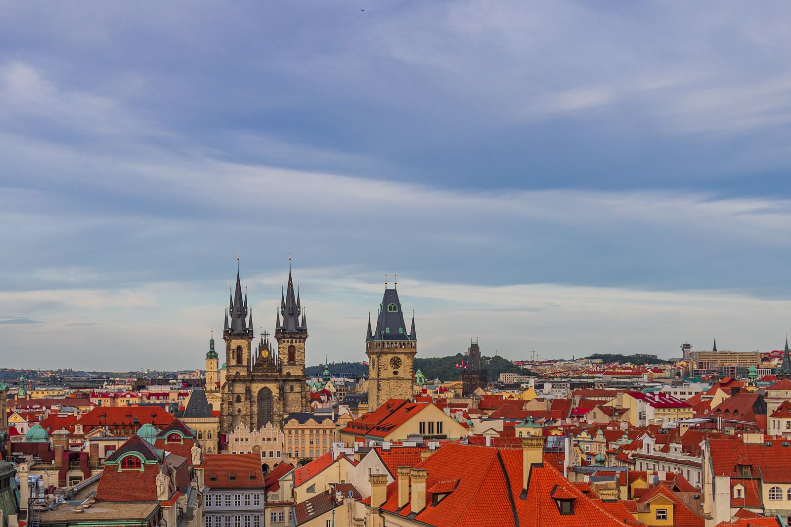
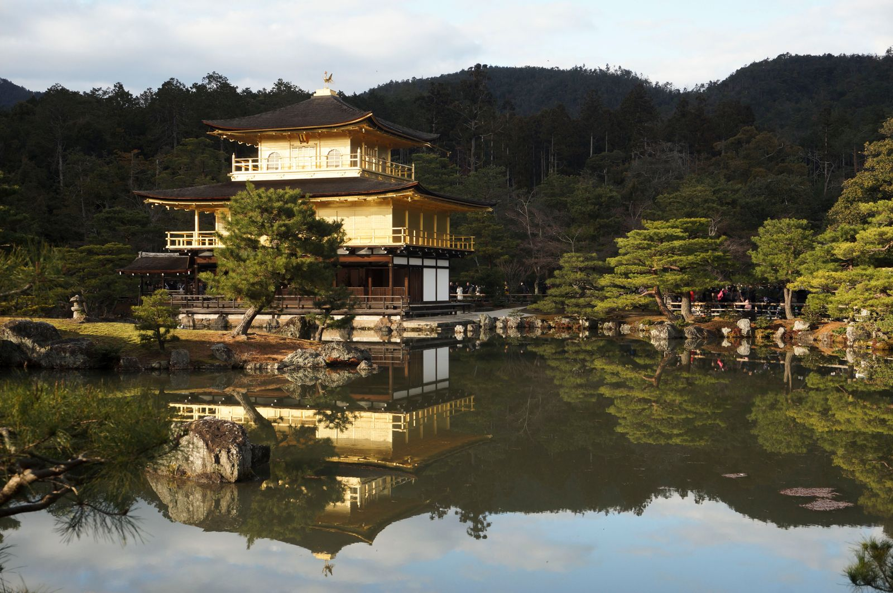
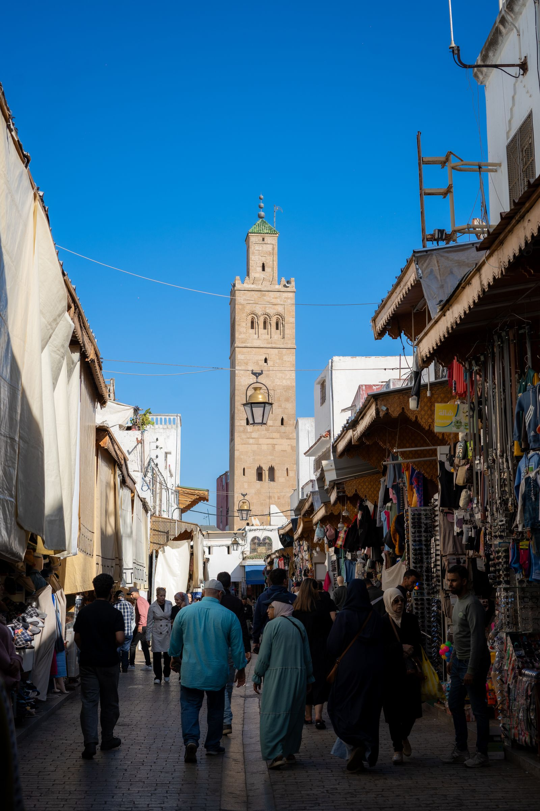
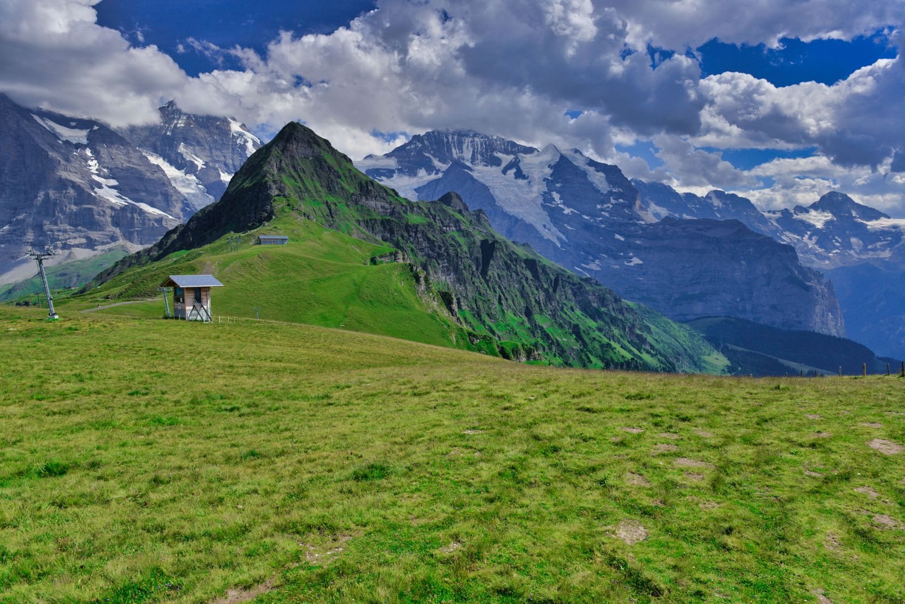
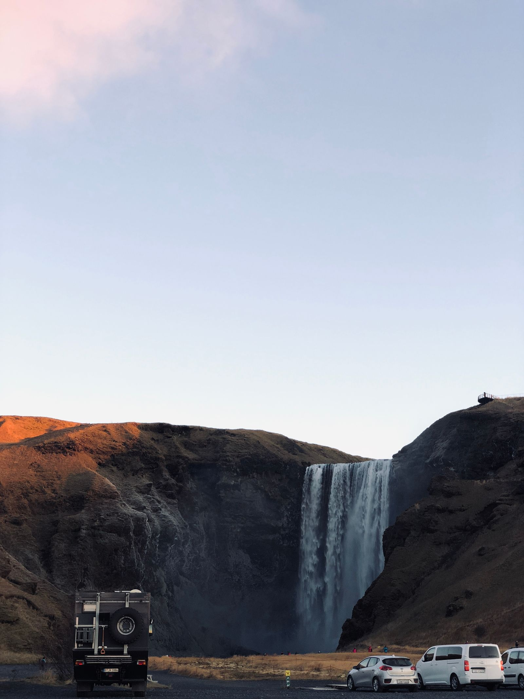
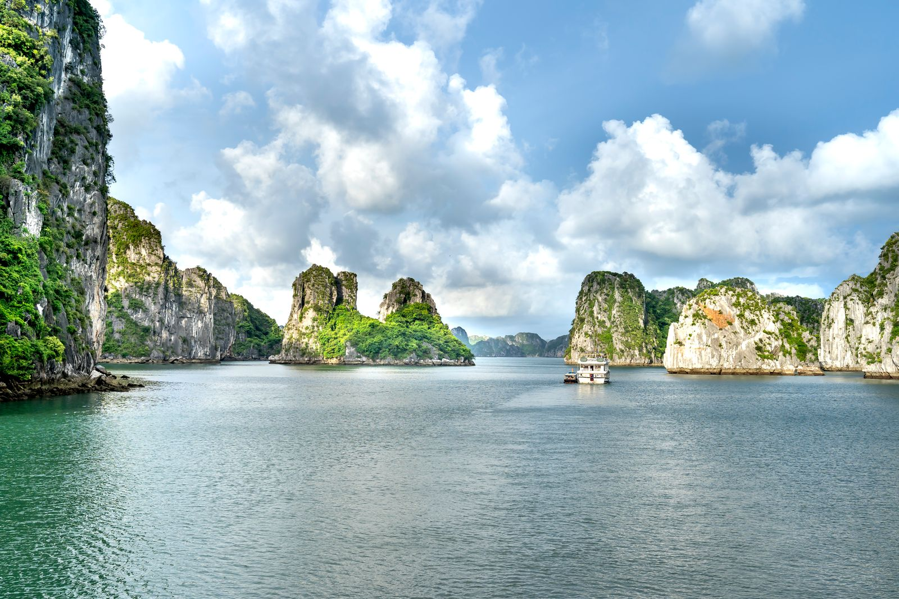
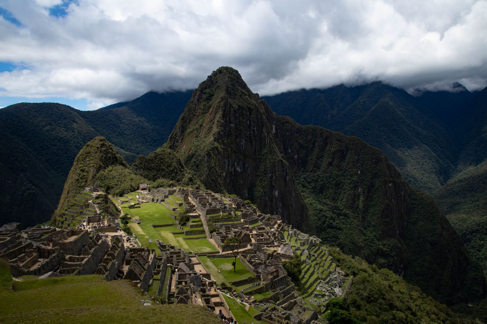
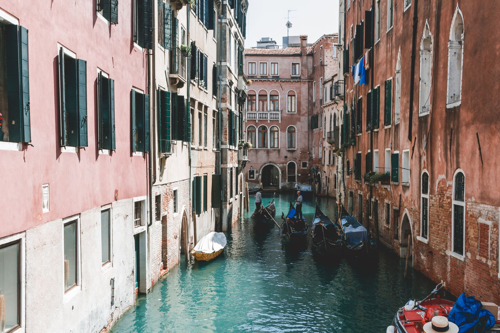
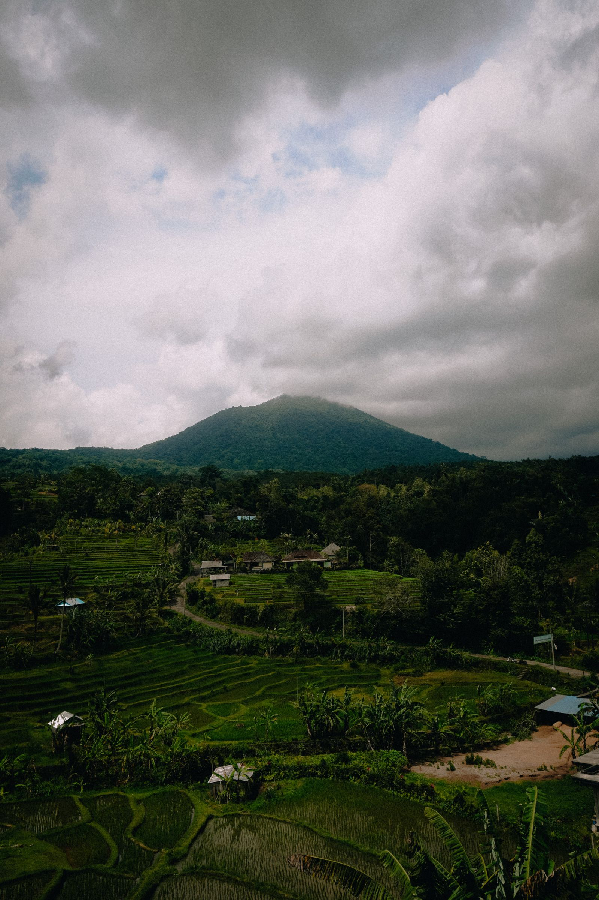

A few photos from travels over the years, alongside the engineering.
All shot on trips around Europe and Asia; a wider set is up on
[Pexels](https://www.pexels.com/hu-hu/@agoston-fung-1165130/). Click a
photo to view it full screen; use the arrows or the ← / → keys to move
between photos.

  <figure>
    
    <figcaption>Seven Sisters, Seaford, England</figcaption>
  </figure>

  <figure>
    
    <figcaption>Winter lake, Hungary</figcaption>
  </figure>

  <figure>
    
    <figcaption>Krk, Croatia</figcaption>
  </figure>

  <figure>
    
    <figcaption>Lake Balaton, Hungary</figcaption>
  </figure>

  <figure>
    
    <figcaption>Terraced mountains, China</figcaption>
  </figure>

  <figure>
    
    <figcaption>Koh Samui, Thailand</figcaption>
  </figure>

  <figure>
    
    <figcaption>Angkor Wat, Cambodia</figcaption>
  </figure>

  <figure>
    
    <figcaption>Barcelona, Spain</figcaption>
  </figure>

  <figure>
    
    <figcaption>Prague, Czechia</figcaption>
  </figure>

  <figure>
    
    <figcaption>Santorini, Greece</figcaption>
  </figure>

  <figure>
    
    <figcaption>Kyoto, Japan</figcaption>
  </figure>

  <figure>
    
    <figcaption>Marrakech, Morocco</figcaption>
  </figure>

  <figure>
    
    <figcaption>Swiss Alps, Switzerland</figcaption>
  </figure>

  <figure>
    
    <figcaption>Skogafoss, Iceland</figcaption>
  </figure>

  <figure>
    
    <figcaption>Trondheim Fjord, Norway</figcaption>
  </figure>

  <figure>
    
    <figcaption>Ha Long Bay, Vietnam</figcaption>
  </figure>

  <figure>
    
    <figcaption>Machu Picchu, Peru</figcaption>
  </figure>

  <figure>
    
    <figcaption>Venice, Italy</figcaption>
  </figure>

  <figure>
    
    <figcaption>Bali, Indonesia</figcaption>
  </figure>

  <button type="button" class="lightbox-close" data-lightbox-close aria-label="Close"></button>
  <button type="button" class="lightbox-nav lightbox-prev" data-lightbox-prev aria-label="Previous photo">&#8249;</button>
  <button type="button" class="lightbox-nav lightbox-next" data-lightbox-next aria-label="Next photo">&#8250;</button>
  
  

