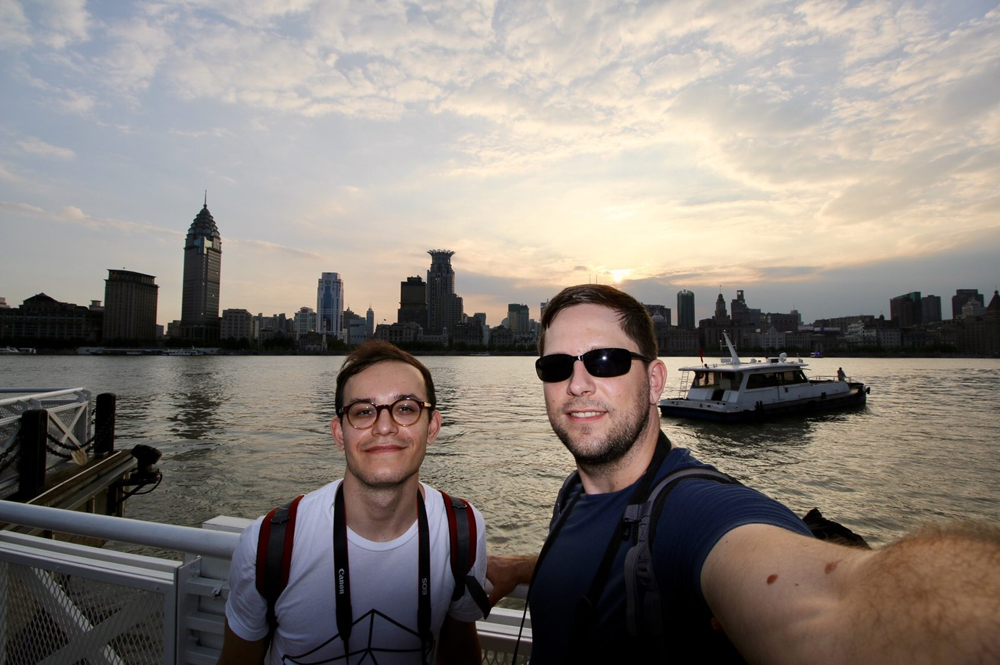
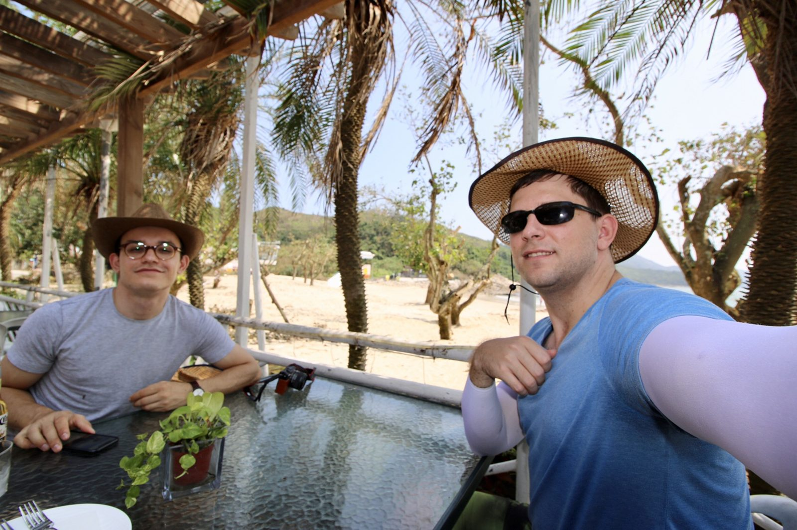
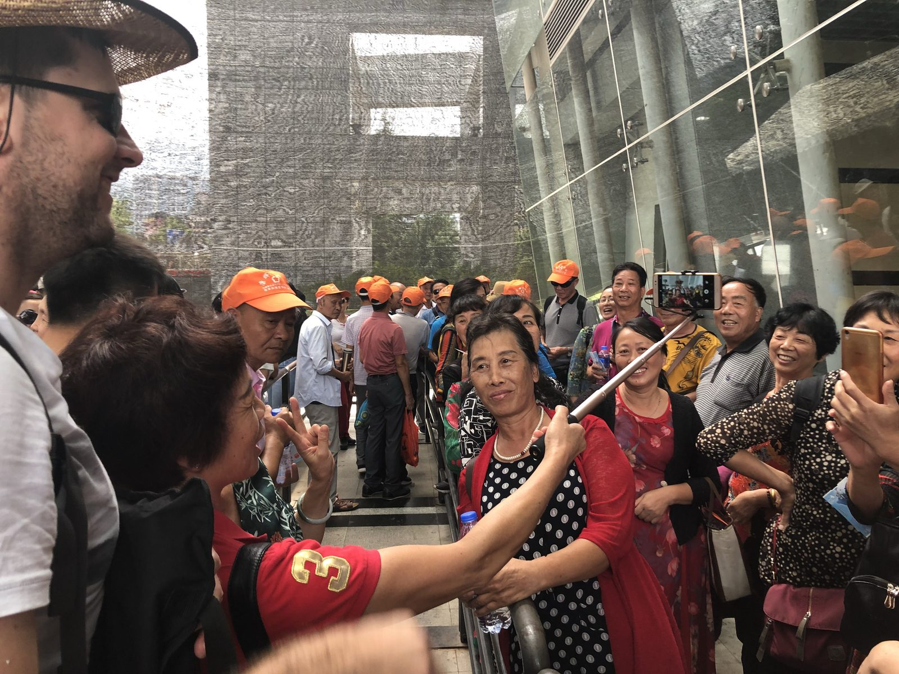
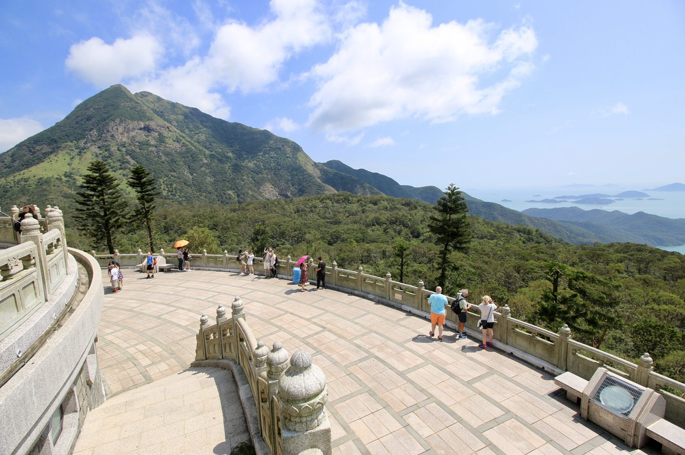
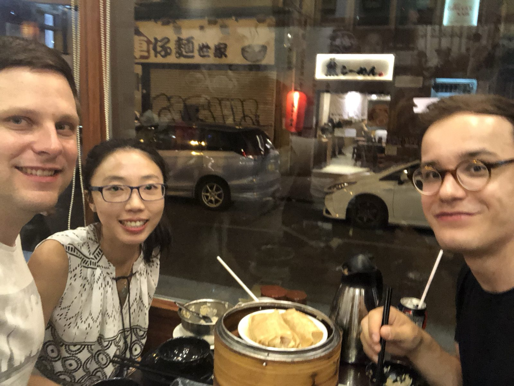
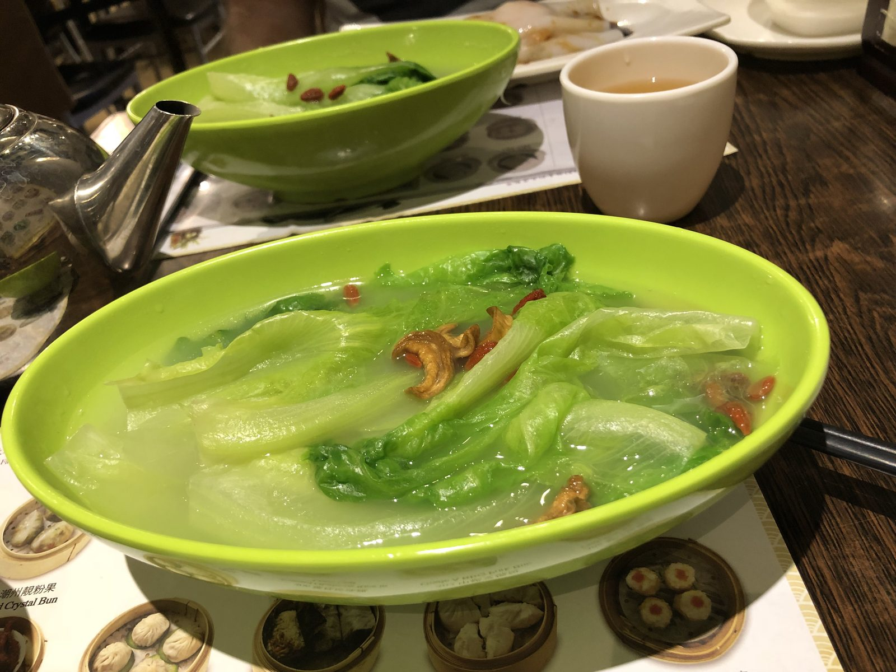

*Ez nekem kínai* is a Hungarian idiom — literally "this is Chinese to me," the way English speakers say "it's all Greek to me." When [Donat](https://www.linkedin.com/in/donblp/) and I spent three weeks travelling across China in September 2018, the title picked itself.

Calling it a project is a stretch — it was really a trip, an event — but it had the shape of one: a start, an end, a pile of logistics, and a blog to document it as we went. That included a running "China WTFs" list for the small daily culture shocks, which never stopped coming.

We started in Shanghai — the Bund at sunset, the sheer scale of everything — then flew inland to Zhangjiajie to climb Tianmen Mountain and wander the sandstone pillars the region is famous for. We finished in Hong Kong: the view from Victoria Peak, the Big Buddha and the viewing platform at Ngong Ping out on Lantau, a slower day on Lamma Island, and more dim sum than was strictly wise.

<figure><figcaption>The Bund at sunset — Shanghai, day one</figcaption></figure>
<figure><figcaption>Ngong Ping, out on Lantau Island</figcaption></figure>
<figure><figcaption>Becoming a tourist attraction ourselves</figcaption></figure>
<figure><figcaption>A slower afternoon on Lamma Island</figcaption></figure>
<figure><figcaption>Dumplings after dark, Hong Kong</figcaption></figure>
<figure><figcaption>Yum cha — greens and endless tea</figcaption></figure>

Three weeks was long enough to get past the postcard version and start noticing how differently a billion people do the ordinary things — queueing, paying, eating, being a tourist. At one point a coach-load of domestic tourists queued up to take selfies *with us*, which is its own kind of culture shock. The whole thing was overwhelming and brilliant in roughly equal measure.

It's all still up on the [blog we kept](https://eznekemkinai2018.wordpress.com/), photos and all.
